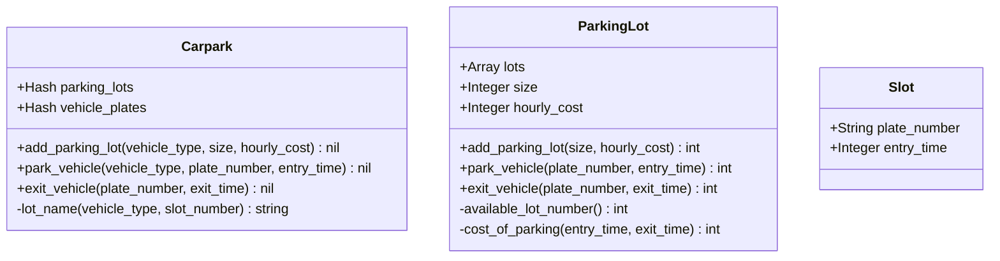

# Carpark System

Developed by Lee Yi Sheng in 2021 for the backend engineer job interview. 

## Dependencies

The solution is written in the **Ruby** programming language so this will need to be installed as a dependency.

The `bundler` ruby gem is required if you want to run the tests.

## Running the program
The main logic for the parking lots system are located in `lib` directory.

To run the program, run the `bin/run {input file path}` in terminal to run the solution. 

Eg: `bin/run spec/fixtures/problem_statement.txt`

## Tests
The test for the parking lots system are located in `spec` directory.

To run the test, please follow the following steps:
1. Ensure bundler is installed or run `gem install bundler`. 
2. run `bundle install` in the project directory to install rspec in in your environment.
3. run `bundle exec rspec` to run the test. 

*Note: To see the test report details, please run `bundle exec rspec --format documentation  `

## Class Diagram

The data structure of the main program is represented in the class diagram above. The brief explanation of each class are as follow:

- **Carpark**: Represents the parking system that houses a variety of vehicle types. It handles the delegation of actions to respective parking lots based on the vehicle type.

- **ParkingLot**: Represents the parking lots for each specific vehicle type. Each parking lot instance has its own maximum capacity and hourly cost set.

- **Slot**: A struct to represent a vehicle parked on the parking lot. It contains information about the vehicle and its entry time. 

- **Parser**: A utility class to parse the input file and invoke the correct methods on the car park.

#Problem Statement
Your task is to design an automated valet car parking system where you manage a parking space for vehicles as they enter/exit it and manage its revenue. The data provided to you(refer to the Data Description section below) would include the number of parking lots available and the entry/exit details of each vehicle. For the purpose of this question you can assume that Cars and Motorcycles are the only two types of vehicles.
Each vehicle upon entry can only park in a lot available for that vehicle type. If there are no lots available for that vehicle type, it should be denied an entry into the space. As we’re building a valet car park, all the lots in the parking space can be considered as being distinctly numbered eg: CarLot1, CarLot2,..., MotorcycleLot1, MotorcycleLot2,.... Each vehicle upon entering is allotted to the lot with the lowest number for that vehicular type eg: a car entering a parking space with the available lots CarLot2, CarLot4, CarLot5 would be assigned to CarLot2. When a vehicle wants to exit the car park, the system will return the parking lot that the vehicle will be removed from and charge them an appropriate parking fee(rounded up to the nearest hour, i.e., 1hr 1min is charged as 2hr): $1/hour for a motorcycle and $2/hour for a car.

